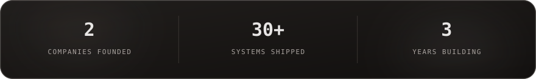
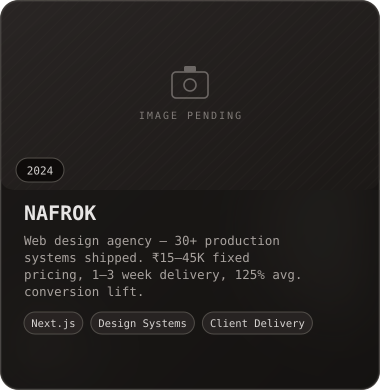
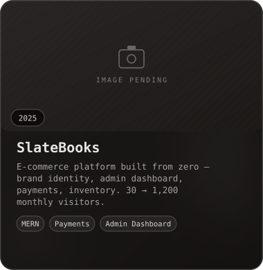
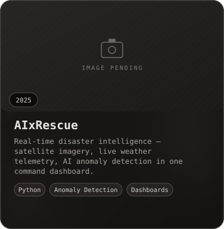
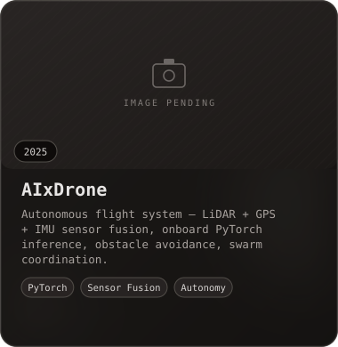
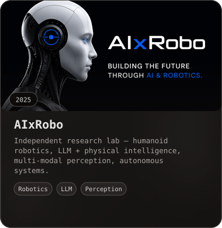
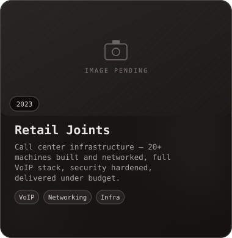
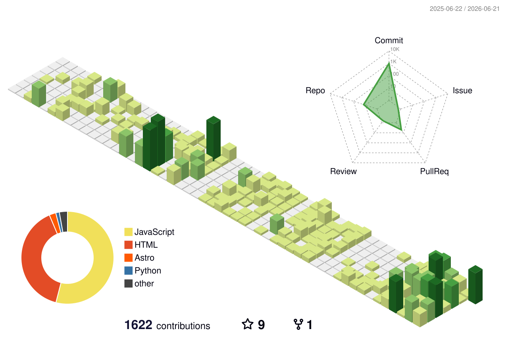

 

  

 

Started at 16 with HTML and CSS — no roadmap, just curiosity. Two companies founded, 30+ production systems shipped, and autonomous machines navigating hostile environments without GPS.

**NAFROK** — Web design agency. Full-stack production websites. Fixed pricing. Ruthless timelines. Measurable results.

**AIxRobo** — Research lab. Autonomous drones, humanoid robotics, and LLM-powered physical intelligence.

 

  

  

  

 

<table width="100%">
<tr>
<td width="140" valign="top"><b>LANGUAGES</b></td>
<td>

</td>
</tr>
<tr>
<td valign="top"><b>FRONTEND / MOBILE</b></td>
<td>

</td>
</tr>
<tr>
<td valign="top"><b>BACKEND / DATA</b></td>
<td>

</td>
</tr>
<tr>
<td valign="top"><b>AI / ROBOTICS</b></td>
<td>

</td>
</tr>
<tr>
<td valign="top"><b>DEVOPS / TOOLS</b></td>
<td>

</td>
</tr>
</table>

 

  

 

<table width="100%">
<tr>
<td width="33%" align="center"></td>
<td width="33%" align="center"></td>
<td width="33%" align="center"></td>
</tr>
<tr><td colspan="3" height="20"></td></tr>
<tr>
<td width="33%" align="center"></td>
<td width="33%" align="center"></td>
<td width="33%" align="center"></td>
</tr>
</table>

 

  

 

  

&ensp;

  

  

 

ahkhan.nafrok@gmail.com &nbsp;·&nbsp; Bangalore, India

  

