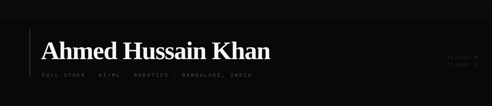

 

 

&ensp;&ensp;&ensp;&ensp;

 

---

Started at 16 with HTML and CSS — no roadmap, just curiosity. Three years later: two companies founded, 30+ production systems shipped, and autonomous machines navigating hostile environments without GPS.

**NAFROK** — Web design agency. Full-stack production websites. Fixed pricing. Ruthless timelines. Measurable results.  
**AIxRobo** — Research lab. Autonomous drones, humanoid robotics, and LLM-powered physical intelligence.

---

 

LANGUAGES

 

  

FRONTEND & MOBILE

 

  

BACKEND & DATABASES

 

  

AI / ML & ROBOTICS

 

  

DEVOPS & TOOLS

 

 

---

 

SELECTED WORK

 

**[NAFROK](https://nafrok.com)** &nbsp; `2024`  
Web design agency — 30+ production systems shipped. ₹15–45K fixed pricing. 1–3 week delivery. 125% avg. conversion lift.

**[SlateBooks](https://slatebooks.in)** &nbsp; `2025`  
E-commerce platform built from zero — brand identity, admin dashboard, payment processing, inventory management. 30 → 1,200 monthly visitors.

**[AIxRescue](https://aixrescue.io)** &nbsp; `2025`  
Real-time disaster intelligence — satellite imagery, live weather telemetry, and AI anomaly detection in a unified command dashboard.

**[AIxDrone](https://aixdrone.io)** &nbsp; `2025`  
Autonomous flight system — LiDAR + GPS + IMU sensor fusion, onboard PyTorch inference, obstacle avoidance, swarm coordination.

**[AIxRobo](https://aixrobo.com)** &nbsp; `2025`  
Independent research lab — humanoid robotics, LLM + physical intelligence, multi-modal perception, autonomous systems.

**[Retail Joints](https://retailjoints.io)** &nbsp; `2023`  
Call center infrastructure — 20+ machines built and networked, full VoIP stack, security hardened, delivered under budget.

 

---

 

GITHUB

 

  

&ensp;

 

---

 
ahkhan.nafrok@gmail.com &nbsp;·&nbsp; Bangalore, India
  

